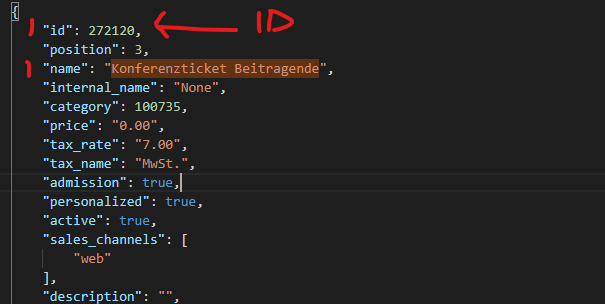

# Namenschilder erstellen (Stand 2023)
Mit diesem Tex files können die Namensschilder für die Lanyards erzeugt
werden.

## 1. JSON Export
Als ersten Schitt müssen aus Pretix die Bestellungen und Rechnungen als JSON-Datei
exportiert werden: 
    
   Z.B. für 2023 
    Bestellungen: https://pretix.eu/control/event/fossgis/2023/orders/export/?identifier=json
    Rechnungen: https://pretix.eu/control/event/fossgis/2023/orders/export/?identifier=dekodi_nrei
    
Diesen kopiert man `bin/2023_pretixdata.json` bzw. ``bin/2023_nrei.json``

## Anpassung ``convert2023.py``. 

Das Skript benötigt python3. Die IDs für Worshops etc. ändern sich ggf. jedes Jahr. 
In den Variablen TICKET_IDs, WORKSHOP_IDs und EXKURSIONEN_IDs müssen sie entsprechend angepasst werden.

Tip:
1. Das JSON lesbar-formatieren, z.B. in VS Code / Chromium öffnen und CTRL+Alt+F
2. Die ID des zugehörigen Items kopieren
  
   

Die Variable ``PATH_BADGE_CSV`` legt fest wie die Ausgabe CSV benannt wird.
Für Sonderfälle können so unterschiedliche CSVs erstellt werden

## 3. CSV erstellen 
Das script ``convert2023.py`` starten um die CSV zu erstellen. 

## 4. Namensschilder per LaTeX erstellen

Ein Badge hat die Größe A7 (quer). Das sich das Lanyard dreht, sollen auf Vorder- und Rückseite die selben Infos stehen.
Dazu wird ein DIN A4 Blatt wie folgt bedruckt:
- 4x Zeilen mit 2x A7 quer nebeneinander
- Vorderseite: 4x 2x A7 (quer) mit den sichtbaren Infos
- Rückseite:  4x 2x A7 (quer) mit privaten Infos (T-Shirt Größe, Gutscheine, Bestellungs-ID)
- Wird ein 2x A7 Streifen zusammen geklappt, ist nur noch die Vorderseite sichtbar 

Dies LaTeX scripte lesen die CSV um ein PDF für die Aussen- und Innenseite zu erstellen:
* `namensschilder_sichtbar.tex` erzeugt `namensschilder_sichtbar.pdf`, für sichtbare Infos
* `namensschilder_innneseite.tex` erzeugt `namensschilder_sichtbar.pdf`, mit den Infos, die beim Zusammenstellen 
 der Konferenzmaterialien (T-Shirt Größe, Gutscheine, ...) benötigt werden.
   
* Um alles "in einem Rutsch" zu erstellen kann auch ``create_namensschilder.bat`` (todo: bash script) aufgerufen 
  werden. Dazu muss in dieser nur der Pfad der Umgebungsvariable ``CSV`` auf die zu verwendete CSV gesetzt werden:
   
      CSV=bin/fehlende_badges.C.2.csv
        

5.## (optional) PDFs mixen
### CLI tool

[qpdf](https://packages.debian.org/bookworm/qpdf) ist hier sehr hilfreich weil automatisierbar ...

```
apt update && apt install qpdf
```

Zum verbinden der beiden Ausgangsdatein deren Pfad/Name angeben und bestätigen - herauskommt eine out.pdf die Vorder- und Innenseite beinhaltet. Beim druck auf duplex achten 😇

```
qpdf --empty --collate=1 --pages namensschilder2024_sichtbar.pdf namensschilder2024_inn
en.pdf -- out.pdf
```

### GUI tools
#### pdf24 🐑
https://help.pdf24.org/de/fragen/frage/pdf-per-reissverschlussverfahren-zusammenfuehren-sortieren/

#### PDF SAM 📎
Nun kann man noch beiden PDFs zu einem machen, indem jede 2. Seite, d.h. die Rückseite eines A4 Blattes, die Innenseite
eines Badges darstellt. 

Das geht beispielsweise mit [PDF Sam -> Alternate Mix](https://pdfsam.org/de/mix-pdf/)


# Workshoplisten erstellen (Stand 2023)

## 1. ``nrei_json`` exportieren

Fall noch nicht geschehen, aus Pretix die Rechnungsdaten im NREI *.json Format exportieren und nach 
``bin\2023_nrei.json`` kopieren

Beispiel 2023: https://pretix.eu/control/event/fossgis/2023/orders/export/?identifier=dekodi_nrei

## 2. workshopliste.py anpassen 

In ``workshopliste.py``:

1. Die Ausgabe CSV festlegen:

        PATH_CSV = 'workshopliste.csv'

2. Die Raumbeschreibung aktualisieren. z.B: 

        class RAUEME(object):
            Spreewald24 = "WS1 Spreewald (1'231) 24 Pätze"
            Teltow16 = "WS2 Teltow (1'101) 16 Plätze"
            Prignitz12 = "WS3 Prignitz (1'230): 12 Plätze"

3. Die Workshops den Räumen zuordnen:

        WS_RAEUME = {
            'Punktwolkeverarbeitung und Analyse mit PDAL': RAUEME.Spreewald24,
            "QGIS 3 Workshop": RAUEME.Prignitz12,
            "MapProxy im Praxiseinsatz": RAUEME.Teltow16,
            "QGIS-Pluginentwicklung mit Python": RAUEME.Spreewald24,
            "Hands on basemap.de": RAUEME.Teltow16,
            "PostgreSQL / PostGIS Workshop für Einsteiger": RAUEME.Spreewald24,
         ...

## 3. workshopliste.py ausführen

Das ``workshopliste.py`` erzeugt den LaTeX code in ``bin\workshopliste.tex``

## 4. workshopliste.tex ausführen

Das script ``workshopliste.tex`` erzeugt die ``workshopliste.pdf`` 

# Systemvoraussetzungen

````bash
sudo apt install texlive-latex-base
sudo apt install texlive-latex-extra
sudo apt-get install texlive-font-utils
sudo apt-get install texlive-fonts-extra

pdflatex namensschilder.tex
````

Anpassung der Datei namensschilder.tex:
Die Datei namensschilder.tex muss angepasst werden. Vor allem muss in der Zeile mit DTLforeach die
auszuwählenden Spaltennamen gesetzt werden (nickname auf die richtige Nr. setzen).
Damit die richtigen Grafiken verwendet werden, müssen diese unter imgs aktualisiert werden (fossgis-konferenz.png, skyline.pdf) 

` \DTLforeach{CSV}{\person=Name,\nickname=8835}`

Aktuell wird pro Zeile der Name zwei mal ausgegeben, damit man das
Namensschild knicken kann und hinten und vorne beschriftet ist und man
in die Mitte noch Zusatzzettel (z.B. die Tokens für die Umfrage)
einlegen kann.

Achtung: Das lesen der CSV-Datei und Erstellen des PDFs dauert
lange. Zum schnelleren Testen sollte man sich daher eine
Test-CSV-Datei mit nur wenigen Zeilen zurecht legen.

Achtung: csv-Datei muss ggf. manuell angepasst werden (Sonderzeichen, falsche Angaben in Spalten). Außerdem sollte das Ergebnis geprüft werden (lange Namen).

Achtung: es sollten ein paar leere Einträge in die csv eingefügt werden. So können während der Konferenz noch Lanyards ausgegeben werden.


