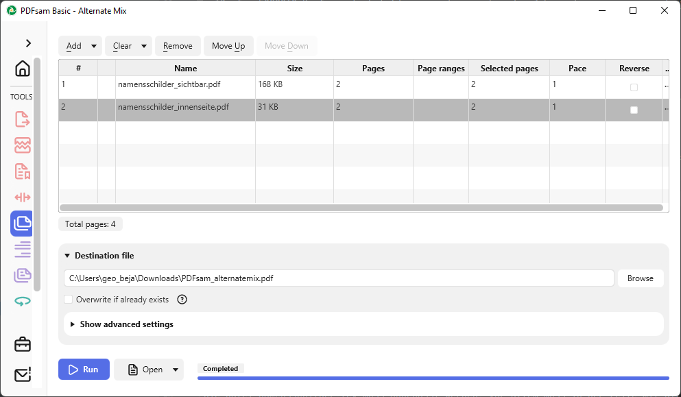

# Namenschilder erstellen
Mit diesem Tex files können die Namensschilder für die Lanyards erzeugt
werden.

1. Als ersten Schitt muss aus Pretix ein Komplettexport als JSON-Datei
erstellt werden. Z.B. für 2018 https://pretix.eu/control/event/fossgis/konf-2018/orders/export/
https://pretix.eu/control/event/fossgis/2023/orders/export/?identifier=json
2. 
   Diesen kopiert man nach `bin/pretixdata.json`


2. Start des convert.py skripts. Das Skript benötigt python3 und muss
unter Umständen noch manuell leicht angepasst werden. Z.B. müssen die
korrekten IDs in die ids-Liste eingetragen werden. Das sind alle ids
die mit Konferenztickets assoziiert sind (Frühbucherticket,
Studierendenticket,...). Heraus fällt pretix.csv

./convert.py

  IDs for FOSSGIS-Konferenzticket (diese aendern sich jedes Jahr und müssen angepasst werden)
  ids = [268184,268185,268218,268218,268218,270039,272120,272122,272123,271553]

3. Namensschilder PDFs erzeugen
Als nächster Schritt müssen mit pdflatex zwei PDFs erzeugt werden:
* `namensschilder_sichtbar.tex` -> `namensschilder_sichtbar.pdf`, für sichtbare Infos
* `namensschilder_innneseite.tex` -> `namensschilder_sichtbar.pdf`, mit Infos die bei Zusammenstellen 
 der Konferenzinfos (T-Shirt, Gutscheine, ...) benötigt werden.

4. (optional) PDFs mixen
Nun kann man noch beiden PDFs zu einem machen, indem dann jede 2. Seite, d.h. die Rückseite eines A4 Blattes, die Innenseite
eines Badges darstellt. Das geht beispielsweise mit [PDF Sam -> Alternate Mix](https://pdfsam.org/de/mix-pdf/)




# Systemvoraussetzungen

````bash
sudo apt install texlive-latex-base
sudo apt install texlive-latex-extra
sudo apt-get install texlive-font-utils
sudo apt-get install texlive-fonts-extra

pdflatex namensschilder.tex
````

Anpassung der Datei namensschilder.tex:
Die Datei namensschilder.tex muss angepasst werden. Vor allem muss in der Zeile mit DTLforeach die
auszuwählenden Spaltennamen gesetzt werden (nickname auf die richtige Nr. setzen).
Damit die richtigen Grafiken verwendet werden, müssen diese unter imgs aktualisiert werden (fossgis-konferenz.png, skyline.pdf) 

` \DTLforeach{CSV}{\person=Name,\nickname=8835}`

Aktuell wird pro Zeile der Name zwei mal ausgegeben, damit man das
Namensschild knicken kann und hinten und vorne beschriftet ist und man
in die Mitte noch Zusatzzettel (z.B. die Tokens für die Umfrage)
einlegen kann.

Achtung: Das lesen der CSV-Datei und Erstellen des PDFs dauert
lange. Zum schnelleren Testen sollte man sich daher eine
Test-CSV-Datei mit nur wenigen Zeilen zurecht legen.

Achtung: csv-Datei muss ggf. manuell angepasst werden (Sonderzeichen, falsche Angaben in Spalten). Außerdem sollte das Ergebnis geprüft werden (lange Namen).

Achtung: es sollten ein paar leere Einträge in die csv eingefügt werden. So können während der Konferenz noch Lanyards ausgegeben werden.


